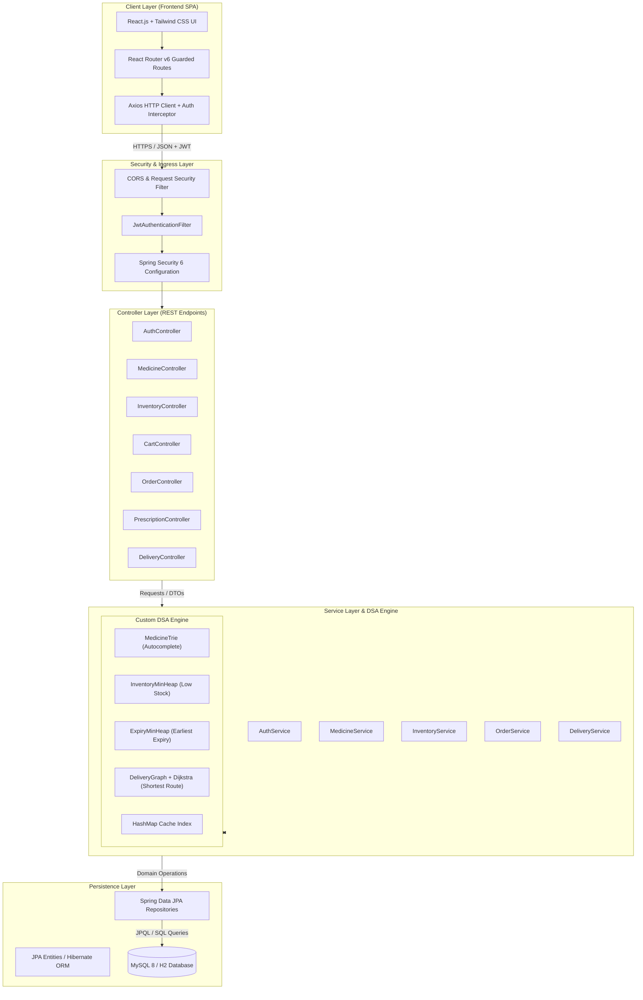
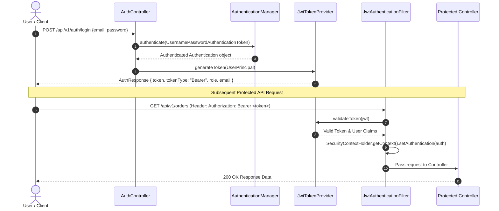

# MEDIFLOW: Architectural Blueprint
## System Architecture & Technical Specifications

---

### 1. High-Level System Architecture

MEDIFLOW strictly adheres to a **Clean Layered Architecture** pattern, enforcing separation of concerns between presentation, business logic, data persistence, and custom algorithmic engines.



---

### 2. Clean Layered Architecture Principles

```
HTTP Request
     │
     ▼
[ Controller Layer ]  ──> Validates DTOs (@Valid), maps request parameters, invokes services.
     │
     ▼
[ Service Layer ]     ──> Implements business rules, coordinates transaction boundaries (@Transactional),
     │                    integrates custom DSA engines (Trie, MinHeap, Dijkstra).
     ▼
[ Repository Layer ]  ──> Extends JpaRepository, handles database queries, custom JPQL/Native queries.
     │
     ▼
[ Database ]          ──> Stores normalized relational entities with foreign keys and indexes.
```

#### DTO & Entity Separation Rules:
1. **Entities** (`com.mediflow.entity.*`) never leak into Controller responses or Client request bodies. They are strictly confined to Service and Persistence layers.
2. **DTOs** (`com.mediflow.dto.*`) encapsulate request payloads (e.g., `LoginRequest`, `CreateOrderRequest`) and response views (e.g., `MedicineResponseDTO`, `OrderSummaryDTO`).
3. **Mappers** or builder patterns explicitly copy data between DTOs and Entities to maintain immutability and shield internal database structures.

---

### 3. Security Architecture (Spring Security 6 + JWT)



---

### 4. Codebase Directory Structure

#### A. Backend Package Structure (`mediflow-backend`)
```
mediflow-backend/
├── pom.xml
├── src/
│   ├── main/
│   │   ├── java/
│   │   │   └── com/
│   │   │       └── mediflow/
│   │   │           ├── MediflowApplication.java
│   │   │           ├── config/
│   │   │           │   ├── SecurityConfig.java
│   │   │           │   ├── SwaggerConfig.java
│   │   │           │   └── WebConfig.java
│   │   │           ├── security/
│   │   │           │   ├── JwtAuthenticationFilter.java
│   │   │           │   ├── JwtTokenProvider.java
│   │   │           │   ├── JwtAuthenticationEntryPoint.java
│   │   │           │   └── UserDetailsServiceImpl.java
│   │   │           ├── controller/
│   │   │           │   ├── AuthController.java
│   │   │           │   ├── MedicineController.java
│   │   │           │   ├── CategoryController.java
│   │   │           │   ├── InventoryController.java
│   │   │           │   ├── CartController.java
│   │   │           │   ├── OrderController.java
│   │   │           │   ├── PrescriptionController.java
│   │   │           │   ├── DeliveryController.java
│   │   │           │   ├── ReviewController.java
│   │   │           │   └── AnalyticsController.java
│   │   │           ├── service/
│   │   │           │   ├── AuthService.java
│   │   │           │   ├── MedicineService.java
│   │   │           │   ├── CategoryService.java
│   │   │           │   ├── InventoryService.java
│   │   │           │   ├── CartService.java
│   │   │           │   ├── OrderService.java
│   │   │           │   ├── PrescriptionService.java
│   │   │           │   ├── DeliveryService.java
│   │   │           │   └── ReviewService.java
│   │   │           ├── dsa/
│   │   │           │   ├── trie/
│   │   │           │   │   ├── TrieNode.java
│   │   │           │   │   └── MedicineTrie.java
│   │   │           │   ├── heap/
│   │   │           │   │   ├── InventoryMinHeap.java
│   │   │           │   │   └── ExpiryMinHeap.java
│   │   │           │   ├── graph/
│   │   │           │   │   ├── GraphNode.java
│   │   │           │   │   ├── GraphEdge.java
│   │   │           │   │   ├── DeliveryGraph.java
│   │   │           │   │   └── DijkstraShortestPath.java
│   │   │           │   └── cache/
│   │   │           │       └── MedicineCacheMap.java
│   │   │           ├── repository/
│   │   │           │   ├── UserRepository.java
│   │   │           │   ├── RoleRepository.java
│   │   │           │   ├── MedicineRepository.java
│   │   │           │   ├── CategoryRepository.java
│   │   │           │   ├── InventoryRepository.java
│   │   │           │   ├── CartRepository.java
│   │   │           │   ├── OrderRepository.java
│   │   │           │   ├── AddressRepository.java
│   │   │           │   ├── PrescriptionRepository.java
│   │   │           │   ├── ReviewRepository.java
│   │   │           │   └── DeliveryRepository.java
│   │   │           ├── entity/
│   │   │           │   ├── User.java
│   │   │           │   ├── Role.java
│   │   │           │   ├── Medicine.java
│   │   │           │   ├── Category.java
│   │   │           │   ├── Inventory.java
│   │   │           │   ├── Cart.java
│   │   │           │   ├── CartItem.java
│   │   │           │   ├── Order.java
│   │   │           │   ├── OrderItem.java
│   │   │           │   ├── Address.java
│   │   │           │   ├── Prescription.java
│   │   │           │   ├── Review.java
│   │   │           │   └── Delivery.java
│   │   │           ├── dto/
│   │   │           │   ├── request/...
│   │   │           │   └── response/...
│   │   │           └── exception/
│   │   │               ├── GlobalExceptionHandler.java
│   │   │               ├── ResourceNotFoundException.java
│   │   │               ├── BadRequestException.java
│   │   │               └── UnauthorizedException.java
│   │   └── resources/
│   │       ├── application.yml
│   │       └── data.sql
│   └── test/
│       └── java/
│           └── com/
│               └── mediflow/
│                   ├── dsa/
│                   │   ├── MedicineTrieTest.java
│                   │   ├── MinHeapTest.java
│                   │   └── DijkstraTest.java
│                   └── service/
│                       └── MedicineServiceTest.java
```

#### B. Frontend Directory Structure (`mediflow-frontend`)
```
mediflow-frontend/
├── package.json
├── vite.config.js
├── tailwind.config.js
├── index.html
└── src/
    ├── main.jsx
    ├── App.jsx
    ├── index.css
    ├── api/
    │   ├── axiosClient.js
    │   ├── authApi.js
    │   ├── medicineApi.js
    │   ├── cartApi.js
    │   ├── orderApi.js
    │   ├── prescriptionApi.js
    │   ├── adminApi.js
    │   └── deliveryApi.js
    ├── context/
    │   └── AuthContext.jsx
    ├── components/
    │   ├── common/
    │   │   ├── Navbar.jsx
    │   │   ├── Sidebar.jsx
    │   │   ├── Footer.jsx
    │   │   ├── LoadingSpinner.jsx
    │   │   └── Toast.jsx
    │   ├── customer/
    │   │   ├── AutocompleteSearch.jsx
    │   │   ├── MedicineCard.jsx
    │   │   ├── CartDrawer.jsx
    │   │   └── PrescriptionUploader.jsx
    │   ├── admin/
    │   │   ├── StatCard.jsx
    │   │   ├── InventoryAlertTable.jsx
    │   │   └── ExpiryAlertTable.jsx
    │   └── delivery/
    │       └── RouteMapVisualizer.jsx
    ├── pages/
    │   ├── customer/
    │   │   ├── HomePage.jsx
    │   │   ├── LoginPage.jsx
    │   │   ├── RegisterPage.jsx
    │   │   ├── MedicinesPage.jsx
    │   │   ├── MedicineDetailPage.jsx
    │   │   ├── CartPage.jsx
    │   │   ├── CheckoutPage.jsx
    │   │   ├── OrdersPage.jsx
    │   │   ├── OrderDetailPage.jsx
    │   │   ├── PrescriptionsPage.jsx
    │   │   └── ProfilePage.jsx
    │   ├── admin/
    │   │   ├── AdminDashboard.jsx
    │   │   ├── AdminMedicinesPage.jsx
    │   │   ├── AdminInventoryPage.jsx
    │   │   ├── AdminOrdersPage.jsx
    │   │   ├── AdminPrescriptionsPage.jsx
    │   │   ├── AdminCustomersPage.jsx
    │   │   ├── AdminDeliveryPage.jsx
    │   │   └── AdminAnalyticsPage.jsx
    │   └── delivery/
    │       ├── DeliveryDashboard.jsx
    │       ├── DeliveryOrdersPage.jsx
    │       └── DeliveryDetailPage.jsx
    └── routes/
        ├── AppRoutes.jsx
        └── ProtectedRoute.jsx
```
