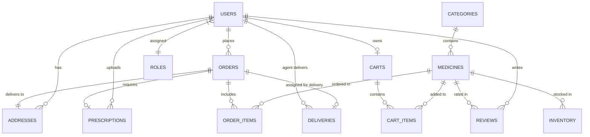

# MEDIFLOW: Relational Database Schema & Data Model
## MySQL 8 / JPA Database Design Specification

---

### 1. Entity-Relationship (ER) Diagram



---

### 2. Normalized Table Schema Definitions (MySQL 8 DDL)

```sql
-- 1. ROLES TABLE
CREATE TABLE roles (
    id BIGINT AUTO_INCREMENT PRIMARY KEY,
    name VARCHAR(50) NOT NULL UNIQUE
);

-- 2. USERS TABLE
CREATE TABLE users (
    id BIGINT AUTO_INCREMENT PRIMARY KEY,
    email VARCHAR(120) NOT NULL UNIQUE,
    password_hash VARCHAR(255) NOT NULL,
    full_name VARCHAR(100) NOT NULL,
    phone VARCHAR(20),
    role_id BIGINT NOT NULL,
    enabled BOOLEAN DEFAULT TRUE,
    created_at TIMESTAMP DEFAULT CURRENT_TIMESTAMP,
    CONSTRAINT fk_users_role FOREIGN KEY (role_id) REFERENCES roles(id)
);

-- 3. CATEGORIES TABLE
CREATE TABLE categories (
    id BIGINT AUTO_INCREMENT PRIMARY KEY,
    name VARCHAR(80) NOT NULL UNIQUE,
    description VARCHAR(255),
    icon_name VARCHAR(50),
    active BOOLEAN DEFAULT TRUE
);

-- 4. MEDICINES TABLE
CREATE TABLE medicines (
    id BIGINT AUTO_INCREMENT PRIMARY KEY,
    category_id BIGINT NOT NULL,
    name VARCHAR(150) NOT NULL,
    generic_name VARCHAR(150),
    manufacturer VARCHAR(100),
    dosage_form VARCHAR(50), -- Tablet, Syrup, Injection, Ointment
    strength VARCHAR(50),    -- 500mg, 650mg, 10mg/ml
    unit_price DECIMAL(10, 2) NOT NULL,
    prescription_required BOOLEAN DEFAULT FALSE,
    description TEXT,
    image_url VARCHAR(500),
    active BOOLEAN DEFAULT TRUE,
    created_at TIMESTAMP DEFAULT CURRENT_TIMESTAMP,
    CONSTRAINT fk_medicines_category FOREIGN KEY (category_id) REFERENCES categories(id)
);

-- 5. INVENTORY TABLE (Batch-level tracking)
CREATE TABLE inventory (
    id BIGINT AUTO_INCREMENT PRIMARY KEY,
    medicine_id BIGINT NOT NULL,
    batch_number VARCHAR(50) NOT NULL UNIQUE,
    stock_quantity INT NOT NULL DEFAULT 0,
    reorder_level INT NOT NULL DEFAULT 10,
    expiry_date DATE NOT NULL,
    status VARCHAR(30) DEFAULT 'IN_STOCK', -- IN_STOCK, LOW_STOCK, EXPIRED, OUT_OF_STOCK
    updated_at TIMESTAMP DEFAULT CURRENT_TIMESTAMP ON UPDATE CURRENT_TIMESTAMP,
    CONSTRAINT fk_inventory_medicine FOREIGN KEY (medicine_id) REFERENCES medicines(id)
);

-- 6. CARTS & CART_ITEMS TABLES
CREATE TABLE carts (
    id BIGINT AUTO_INCREMENT PRIMARY KEY,
    user_id BIGINT NOT NULL UNIQUE,
    updated_at TIMESTAMP DEFAULT CURRENT_TIMESTAMP ON UPDATE CURRENT_TIMESTAMP,
    CONSTRAINT fk_carts_user FOREIGN KEY (user_id) REFERENCES users(id)
);

CREATE TABLE cart_items (
    id BIGINT AUTO_INCREMENT PRIMARY KEY,
    cart_id BIGINT NOT NULL,
    medicine_id BIGINT NOT NULL,
    quantity INT NOT NULL DEFAULT 1,
    unit_price DECIMAL(10, 2) NOT NULL,
    CONSTRAINT fk_cart_items_cart FOREIGN KEY (cart_id) REFERENCES carts(id) ON DELETE CASCADE,
    CONSTRAINT fk_cart_items_medicine FOREIGN KEY (medicine_id) REFERENCES medicines(id)
);

-- 7. ADDRESSES TABLE (With Graph Node mapping for Dijkstra delivery)
CREATE TABLE addresses (
    id BIGINT AUTO_INCREMENT PRIMARY KEY,
    user_id BIGINT NOT NULL,
    recipient_name VARCHAR(100) NOT NULL,
    phone VARCHAR(20) NOT NULL,
    street_address VARCHAR(255) NOT NULL,
    city VARCHAR(80) NOT NULL,
    state VARCHAR(80) NOT NULL,
    postal_code VARCHAR(20) NOT NULL,
    graph_node_id INT NOT NULL DEFAULT 1, -- Node index for delivery graph
    is_default BOOLEAN DEFAULT FALSE,
    CONSTRAINT fk_addresses_user FOREIGN KEY (user_id) REFERENCES users(id)
);

-- 8. PRESCRIPTIONS TABLE
CREATE TABLE prescriptions (
    id BIGINT AUTO_INCREMENT PRIMARY KEY,
    customer_id BIGINT NOT NULL,
    file_path VARCHAR(500) NOT NULL,
    original_filename VARCHAR(255) NOT NULL,
    status VARCHAR(30) DEFAULT 'PENDING', -- PENDING, VERIFIED, REJECTED
    admin_notes VARCHAR(255),
    uploaded_at TIMESTAMP DEFAULT CURRENT_TIMESTAMP,
    CONSTRAINT fk_prescriptions_customer FOREIGN KEY (customer_id) REFERENCES users(id)
);

-- 9. ORDERS & ORDER_ITEMS TABLES
CREATE TABLE orders (
    id BIGINT AUTO_INCREMENT PRIMARY KEY,
    order_number VARCHAR(40) NOT NULL UNIQUE,
    customer_id BIGINT NOT NULL,
    total_amount DECIMAL(10, 2) NOT NULL,
    order_status VARCHAR(30) DEFAULT 'PLACED', -- PLACED, VERIFIED, PROCESSING, OUT_FOR_DELIVERY, DELIVERED, CANCELLED
    payment_status VARCHAR(30) DEFAULT 'PENDING', -- PENDING, PAID, FAILED
    shipping_address_id BIGINT NOT NULL,
    prescription_id BIGINT,
    created_at TIMESTAMP DEFAULT CURRENT_TIMESTAMP,
    CONSTRAINT fk_orders_customer FOREIGN KEY (customer_id) REFERENCES users(id),
    CONSTRAINT fk_orders_address FOREIGN KEY (shipping_address_id) REFERENCES addresses(id),
    CONSTRAINT fk_orders_prescription FOREIGN KEY (prescription_id) REFERENCES prescriptions(id)
);

CREATE TABLE order_items (
    id BIGINT AUTO_INCREMENT PRIMARY KEY,
    order_id BIGINT NOT NULL,
    medicine_id BIGINT NOT NULL,
    quantity INT NOT NULL,
    unit_price DECIMAL(10, 2) NOT NULL,
    subtotal DECIMAL(10, 2) NOT NULL,
    CONSTRAINT fk_order_items_order FOREIGN KEY (order_id) REFERENCES orders(id) ON DELETE CASCADE,
    CONSTRAINT fk_order_items_medicine FOREIGN KEY (medicine_id) REFERENCES medicines(id)
);

-- 10. REVIEWS TABLE
CREATE TABLE reviews (
    id BIGINT AUTO_INCREMENT PRIMARY KEY,
    medicine_id BIGINT NOT NULL,
    customer_id BIGINT NOT NULL,
    rating INT NOT NULL CHECK (rating >= 1 AND rating <= 5),
    comment TEXT,
    created_at TIMESTAMP DEFAULT CURRENT_TIMESTAMP,
    CONSTRAINT fk_reviews_medicine FOREIGN KEY (medicine_id) REFERENCES medicines(id),
    CONSTRAINT fk_reviews_customer FOREIGN KEY (customer_id) REFERENCES users(id)
);

-- 11. DELIVERIES TABLE
CREATE TABLE deliveries (
    id BIGINT AUTO_INCREMENT PRIMARY KEY,
    order_id BIGINT NOT NULL UNIQUE,
    delivery_agent_id BIGINT,
    status VARCHAR(30) DEFAULT 'ASSIGNED', -- ASSIGNED, PICKED_UP, IN_TRANSIT, DELIVERED, FAILED
    optimal_route_nodes VARCHAR(255),       -- e.g., "HUB-1 -> NODE-3 -> NODE-7 -> NODE-12"
    total_distance_km DECIMAL(6, 2),
    estimated_time_mins INT,
    assigned_at TIMESTAMP DEFAULT CURRENT_TIMESTAMP,
    picked_up_at TIMESTAMP NULL,
    delivered_at TIMESTAMP NULL,
    CONSTRAINT fk_deliveries_order FOREIGN KEY (order_id) REFERENCES orders(id),
    CONSTRAINT fk_deliveries_agent FOREIGN KEY (delivery_agent_id) REFERENCES users(id)
);
```

---

### 3. Indexes & Optimization Strategy

```sql
-- Fast lookup index for Medicine Search & Categorization
CREATE INDEX idx_medicines_name ON medicines(name);
CREATE INDEX idx_medicines_category ON medicines(category_id);

-- Inventory Expiry & Low Stock Indexing
CREATE INDEX idx_inventory_expiry ON inventory(expiry_date);
CREATE INDEX idx_inventory_stock ON inventory(stock_quantity);

-- Orders per customer query optimization
CREATE INDEX idx_orders_customer ON orders(customer_id);
CREATE INDEX idx_orders_status ON orders(order_status);
```
