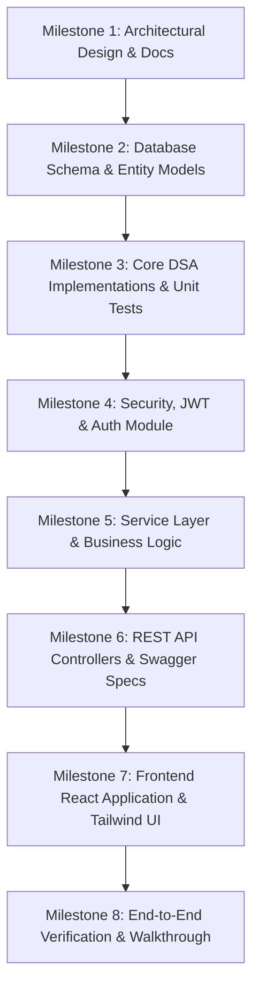

# MEDIFLOW: Smart Pharmacy & Healthcare Management Platform
## Project Plan & Implementation Roadmap

---

### 1. Executive Summary & Vision

**MEDIFLOW** is an enterprise-grade, production-style Smart Pharmacy & Healthcare Management SaaS platform designed to showcase modern full-stack software engineering, clean layered architecture, robust security, normalized database design, and real-world Data Structures & Algorithms (DSA) integration in **Java 21 / Spring Boot 3** and **React.js**.

This project serves as a cornerstone portfolio application for software engineering roles, demonstrating proficiency in:
- Backend Architecture with Spring Boot 3, Spring Security 6 (Stateless JWT), and Spring Data JPA.
- Frontend Design with React, Tailwind CSS, Axios, and React Router.
- Algorithmic Problem Solving (Trie Autocomplete, Inventory Min-Heaps, Dijkstra's Shortest Delivery Route).
- Relational Database Design with MySQL 8 & JPA ORM mappings.
- Clean Code, Automated Unit & Integration Testing (JUnit 5, Mockito).

---

### 2. Comprehensive Technology Stack

| Layer | Technology | Purpose / Details |
| :--- | :--- | :--- |
| **Backend Core** | Java 21 LTS | Modern Java features (Record types, Pattern Matching, Sealed classes, Virtual Threads compatibility) |
| **Framework** | Spring Boot 3.2.x | Core framework for dependency injection, REST services, and transaction management |
| **Security** | Spring Security 6 + JWT | Stateless Bearer token authentication, BCrypt password hashing, Role-based Access Control (RBAC) |
| **Data Access** | Spring Data JPA / Hibernate | ORM mapping, repositories, custom JPQL, and native query optimization |
| **Validation** | Jakarta Bean Validation | Request payload integrity check (`@NotNull`, `@Email`, `@Size`, etc.) |
| **Documentation** | Springdoc OpenAPI (Swagger UI 3) | Interactive API exploration and OpenAPI 3.0 specification |
| **Testing** | JUnit 5, Mockito, Spring Boot Test | Comprehensive unit tests for services/DSA and integration tests for controllers |
| **Frontend UI** | React.js (Vite SPA) | Fast, modular component architecture |
| **Styling** | Tailwind CSS | Healthcare-themed, responsive design system (Navy `#1e3a8a`, Teal `#0d9488`, Clean Slate `#f8fafc`) |
| **Routing** | React Router v6 | Declarative client-side routing with protected route guards per user role |
| **HTTP Client** | Axios | Intercepted API calls with automatic JWT handling and global error toasts |
| **Database** | MySQL 8 / H2 | Relational storage with foreign key constraints, indexing, and transactional isolation |
| **Build Tools** | Maven (Backend), npm (Frontend) | Standard dependency management and compilation pipelines |

---

### 3. Role-Based Feature Scope

#### A. Customer Role (`ROLE_CUSTOMER`)
- **Authentication & Security**: Account registration, JWT login/logout, profile management.
- **Medicine Discovery**: Search medicine with Trie autocomplete, category filtering, price sorting, detail modal/page.
- **Shopping Cart**: Add items, update quantities, real-time total calculation, remove items, clear cart.
- **Prescription System**: Upload digital prescriptions (PNG, JPG, PDF), track verification status (`PENDING`, `VERIFIED`, `REJECTED`).
- **Checkout & Address Management**: Multi-address management, node mapping for delivery routing, order placement.
- **Order Tracking & History**: Order list, itemized details, live status progression (`PLACED`, `VERIFIED`, `OUT_FOR_DELIVERY`, `DELIVERED`), reorder previous items.
- **Reviews & Ratings**: Submit 1-5 star ratings and textual reviews for purchased medicines.

#### B. Pharmacy Admin Role (`ROLE_PHARMACY_ADMIN`)
- **Dashboard & Analytics**: Total revenue, order count, total customers, low-stock alerts, near-expiry alerts, sales trends.
- **Medicine & Category Management**: Add/Edit/Deactivate medicines, category CRUD.
- **Inventory Management**: Min-Heap prioritized low-stock monitoring, Expiry Priority Queue monitoring, batch quantity updates.
- **Prescription Verification**: Inspect customer uploaded prescriptions, verify/reject with admin comments.
- **Order & Delivery Management**: Approve orders, assign delivery agents, trigger shortest-route calculations.
- **Customer Directory**: View customer profiles, order history, and account status.

#### C. Delivery Agent Role (`ROLE_DELIVERY_AGENT`)
- **Delivery Dashboard**: View assigned pending and active deliveries.
- **Route Optimization**: Dijkstra's algorithm generated optimal shortest path with map node visual step-by-step guidance.
- **Status Updates**: Mark delivery as `PICKED_UP`, `IN_TRANSIT`, `DELIVERED`, or `FAILED` with timestamp recording.

---

### 4. Applied Data Structures & Algorithms (DSA)

| DSA Component | Application Problem Solved | Algorithmic Complexity |
| :--- | :--- | :--- |
| **1. Trie (Prefix Tree)** | Instant prefix autocomplete search for medicines (`para` -> `Paracetamol 500mg`, `Paracetamol 650mg`, `Paracetamol Syrup`). | Search: $O(K + N)$ where $K$ is prefix length and $N$ is matching results |
| **2. Inventory Min-Heap** | Priority Queue keeping critical low-stock items at top of Admin Dashboard. | Peek: $O(1)$, Insert/Extract: $O(\log N)$ |
| **3. Expiry Min-Heap** | Priority Queue ordering medicine batches by nearest expiration date for FEFO (First-Expired-First-Out) management. | Peek: $O(1)$, Insert/Extract: $O(\log N)$ |
| **4. HashMap Indexing** | $O(1)$ lookup cache for fast medicine price retrieval, stock checks, and category grouping. | Lookup/Insert: $O(1)$ average time |
| **5. Weighted Graph & Dijkstra** | Shortest path route optimization between pharmacy fulfillment hubs and customer delivery address nodes. | $O((V + E) \log V)$ using Min-Priority Queue |

---

### 5. Implementation Roadmap & Milestones

#### Phase Breakdown:
1. **Phase 1 (Completed)**: Architecture, Database Design, API Specs, DSA Design, and Project Plan.
2. **Phase 2**: Spring Boot Backend setup, Maven POM, JPA Entities, Repositories, Database Initialization SQL scripts.
3. **Phase 3**: Custom DSA Package (`TrieNode`, `MedicineTrie`, `InventoryMinHeap`, `DeliveryGraph`, `DijkstraShortestPath`) with unit tests.
4. **Phase 4**: Spring Security 6 config, JWT Token Provider, Custom UserDetailsService, Auth Controller.
5. **Phase 5**: Business Services (Medicine, Inventory, Cart, Order, Prescription, Delivery, Review, Analytics).
6. **Phase 6**: REST Controllers with Bean Validation and Global Exception Handler (`@ControllerAdvice`).
7. **Phase 7**: React Frontend with Tailwind CSS, React Router v6, Role-based route guards, and Axios API layer.
8. **Phase 8**: Integration verification, execution testing, and artifact documentation.

---

### 6. Quality & Verification Protocols

- **Backend Unit Tests**: Verify DSA implementations (Trie search, Min-Heap sorting, Dijkstra routing) with JUnit 5.
- **Service & Security Tests**: Verify password hashing, JWT generation/validation, and business logic using Mockito.
- **Build Verification**: Run `./mvnw clean compile` and `npm run build` to confirm zero compilation or lint errors.
- **Runtime Verification**: Launch backend and verify REST endpoints via test calls.
